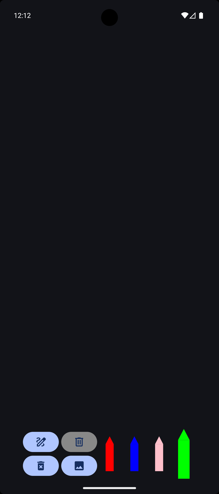
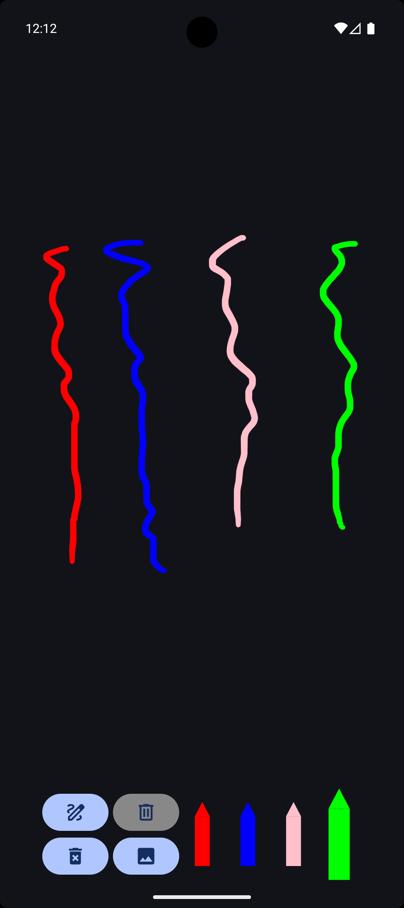

# Ink API Compose

This open-source project tests the new Google Ink API with an example for drawing, offering options
to select colors and erase the drawing. It also includes functionality to convert the stroke to a
bitmap and to save and load the stroke using a Room database.

## Examples

  
  
  

## A Brief History Behind This Repository :smiley:

I began this project to test the new Google Ink API, and while I was working on it, my son saw it
and asked if he could draw. I told him to wait, then quickly implemented a simple version with
options to select colors and erase the drawing. After generating the APKs (my daughter also saw it),
I installed the app on their tablet, and they started drawing right away.

## Here’s a list of features to highlight for the app

- Color Selection: Allows users to choose from a variety of colors for drawing.
- Erase Tool: Provides the option to erase any part of the drawing.
- Tablet Compatibility: Works seamlessly on tablets for an enhanced drawing experience.
- Convert the stroke to a bitmap and display it in a dialog.
- An example of how to save a stroke to the Room database and load it from the database.
    - In this example, the implementation always uses a single primary key with id = 1, overriding
      the
      stroke each time. This is not the best approach, but it is used here for simplicity and
      demonstration purposes only. When the app goes into the background or is closed, the stroke is
      saved. When the app is opened again, the last saved stroke is loaded.

# The Project Contain the following technologies

The programming language is the [Kotlin](https://kotlinlang.org/docs/getting-started.html), it is a
modern, JVM-based programming language that is concise, safe, and interoperable with Java.  
[Kotlin Coroutines](https://kotlinlang.org/docs/coroutines-overview.html) is used for asynchronous
tasks.  
[Kotlin KTX](https://developer.android.com/kotlin/ktx) is a collection of Kotlin extensions that
offer more concise and expressive code for working with Android APIs and libraries.
The UI is build using [Jetpack Compose](https://developer.android.com/develop/ui/compose).  
[Room Database](https://developer.android.com/training/data-storage/room) is responsible for saving
the retrieved data from the remote server, querying data from the local database, and supporting
offline functionality.   
[Hilt Dependencies Injection](https://developer.android.com/training/dependency-injection/hilt-android)
is an Android library that simplifies dependency injection by using annotations to automatically
manage and provide dependencies across components, built on top of
Dagger. ([Documentation](https://dagger.dev/hilt/))  
[MVVM](https://developer.android.com/topic/architecture#recommended-app-arch) with repository is an
architecture where the Repository manages data sources (e.g., network, database), the ViewModel
processes the data for the UI, and the View displays the UI, ensuring a clear separation of
concerns.  
[KSP](https://kotlinlang.org/docs/ksp-overview.html) (Kotlin Symbol Processing) is a tool for
processing Kotlin code at compile time, enabling developers to create powerful code generation and
annotation processing solutions. (ksp only setup for Room
Database) ([Repository](https://github.com/google/ksp))  
[R8](https://developer.android.com/build/shrink-code) enabled, is a code shrinker and obfuscator for
Android that optimizes and reduces the size of APKs by removing unused code and resources, while
also obfuscating the remaining code to improve security.  
[Gradle Kotlin DSL](https://docs.gradle.org/current/userguide/kotlin_dsl.html) is a domain-specific
language for configuring Gradle build scripts using Kotlin syntax, offering better IDE support and
type safety compared to Groovy.  

## Versioning

Ink Api version: 1.0.0  
Target SDK version: 36  
Minimum SDK version: 29  
Kotlin version: 2.3.0  
Gradle version: 8.13.2  

## References - Useful Links

- https://android-developers.googleblog.com/2024/10/introducing-ink-api-jetpack-library.html  
- https://developer.android.com/develop/ui/compose/touch-input/stylus-input/about-ink-api  
- https://developer.android.com/develop/ui/compose/touch-input/stylus-input/ink-api-modules  
- https://developer.android.com/develop/ui/compose/touch-input/stylus-input/ink-api-setup  
- https://developer.android.com/develop/ui/compose/touch-input/stylus-input/ink-api-draw-stroke  
- https://developer.android.com/develop/ui/compose/touch-input/stylus-input/ink-api-geometry-apis  
- https://developer.android.com/develop/ui/compose/touch-input/stylus-input/ink-api-state-preservation  
- https://developer.android.com/jetpack/androidx/releases/ink  
- https://x.com/AndroidDev/status/1843758267404554563  
- https://issuetracker.google.com/issues/383380976  

### Important Resources for optimize storage to save the Stroke in Room Database (Examples)  

- https://developer.android.com/develop/ui/compose/touch-input/stylus-input/ink-api-state-preservation  
- https://github.com/android/cahier  
- https://github.com/android/cahier/blob/main/app/src/main/java/com/example/cahier/data/OfflineNotesRepository.kt  
- https://github.com/android/cahier/blob/main/app/src/main/java/com/example/cahier/ui/Converters.kt  
- https://developer.android.com/reference/kotlin/androidx/ink/storage/package-summary#(androidx.ink.strokes.StrokeInputBatch).encode(java.io.OutputStream)  