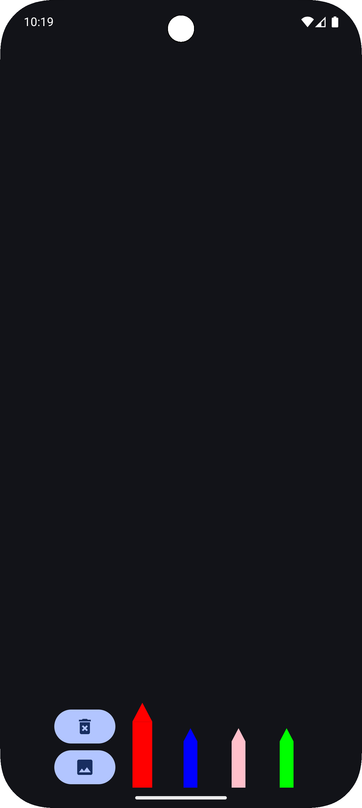
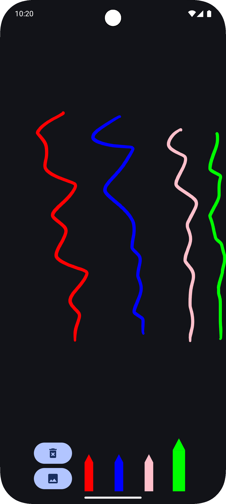

# Ink API Compose

This open-source project tests the new Google Ink API with an example for drawing, offering options
to select colors and erase the drawing. It also includes functionality to convert the stroke to a
bitmap and to save and load the stroke using a Room database.

## Examples

  
  
  

## A Brief History Behind This Repository :smiley:

I began this project to test the new Google Ink API, and while I was working on it, my son saw it
and asked if he could draw. I told him to wait, then quickly implemented a simple version with
options to select colors and erase the drawing. After generating the APKs (my daughter also saw it),
I installed the app on their tablet, and they started drawing right away.

## Here’s a list of features to highlight for the app

- Color Selection: Allows users to choose from a variety of colors for drawing.
- Erase Tool: Provides the option to erase any part of the drawing.
- Tablet Compatibility: Works seamlessly on tablets for an enhanced drawing experience.
- Convert the stroke to a bitmap and display it in a dialog.
- An example of how to save a stroke to the Room database and load it from the database.
    - In this example, the implementation always uses a single primary key with id = 1, overriding
      the
      stroke each time. This is not the best approach, but it is used here for simplicity and
      demonstration purposes only. When the app goes into the background or is closed, the stroke is
      saved. When the app is opened again, the last saved stroke is loaded.

## Versioning

Ink Api version: 1.0.0-alpha04  
Target SDK version: 35  
Minimum SDK version: 28  
Kotlin version: 2.1.20  
Gradle version: 8.10.0  

## References - Useful Links

https://android-developers.googleblog.com/2024/10/introducing-ink-api-jetpack-library.html  
https://developer.android.com/develop/ui/compose/touch-input/stylus-input/about-ink-api  
https://developer.android.com/develop/ui/compose/touch-input/stylus-input/ink-api-modules  
https://developer.android.com/develop/ui/compose/touch-input/stylus-input/ink-api-setup  
https://developer.android.com/develop/ui/compose/touch-input/stylus-input/ink-api-draw-stroke  
https://developer.android.com/develop/ui/compose/touch-input/stylus-input/ink-api-geometry-apis  
https://developer.android.com/jetpack/androidx/releases/ink  
https://x.com/AndroidDev/status/1843758267404554563  
https://issuetracker.google.com/issues/383380976  