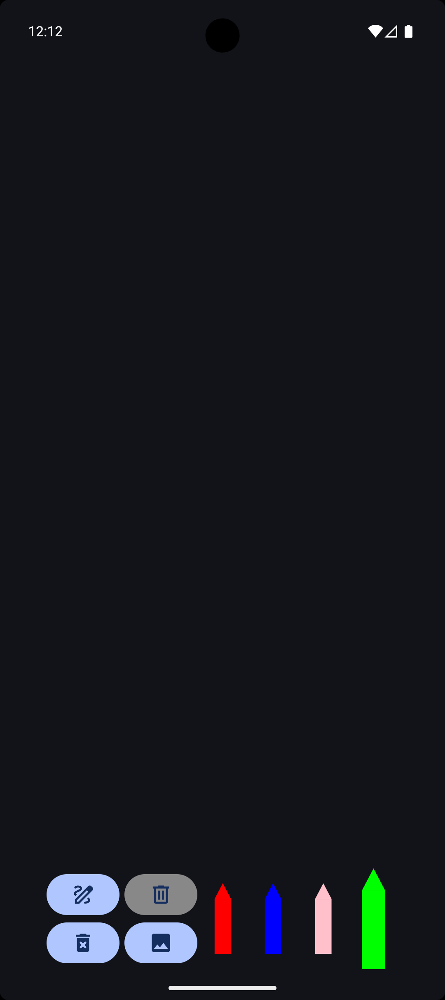
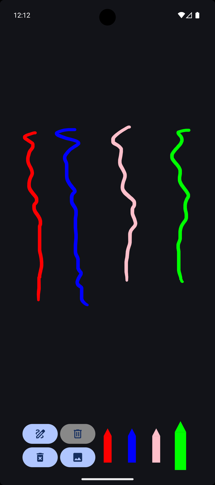

# Ink API Compose

This open-source project tests the new Google Ink API with a drawing example. It offers options to select colors, erase parts of the drawing, or clear the entire canvas. It also includes functionality to convert the stroke to a bitmap and to save and load the stroke using a Room database.

## ✨ Features

*   **Smooth Drawing:** Built with the **[Ink API](https://developer.android.com/develop/ui/compose/touch-input/stylus-input/about-ink-api?utm_source=android-studio-app&utm_medium=app)** for low-latency, freehand drawing with stylus and pointer input.
*   **Modern UI:** Crafted entirely with **Jetpack Compose** for a declarative and intuitive user interface.
*   **Color Selection:** Allows users to choose from a variety of colors for their drawings.
*   **Erase Tool:** Provides options to erase parts of the drawing or clear the entire canvas.
*   **Offline Storage:** Saves and loads drawings using **Room Database**, preserving the user's work across app sessions.
*   **Bitmap Conversion:** Includes functionality to convert the ink stroke into a bitmap, which can be displayed in a dialog.
*   **Scalable Architecture:** Follows the **MVVM** pattern with a repository, ensuring a clean separation of concerns and maintainable code.
*   **Optimized Performance:** Leverages **Coroutines** for asynchronous tasks, **KSP** for faster annotation processing (for Room), and **R8** for code shrinking.

## 📸 Screenshots & Demos

  
  
  

## 🛠️ Tech Stack & Libraries

This project is built with **[Kotlin](https://kotlinlang.org/docs/getting-started.html)** and utilizes a variety of modern Android libraries and tools:

-   **UI:** [Jetpack Compose](https://developer.android.com/develop/ui/compose), [Ink API](https://developer.android.com/develop/ui/compose/touch-input/stylus-input/about-ink-api)
-   **Architecture:** [MVVM](https://developer.android.com/topic/architecture#recommended-app-arch) with Repository Pattern
-   **Asynchronicity:** [Kotlin Coroutines](https://kotlinlang.org/docs/coroutines-overview.html), [Kotlin KTX](https://developer.android.com/kotlin/ktx)
-   **Data:** [Room Database](https://developer.android.com/training/data-storage/room) (for local storage)
-   **Dependency Injection:** [Hilt](https://dagger.dev/hilt/)
-   **Build & Optimization:** [KSP](https://kotlinlang.org/docs/ksp-overview.html) (for Room), [R8](https://developer.android.com/build/shrink-code), [Gradle Kotlin DSL](https://docs.gradle.org/current/userguide/kotlin_dsl.html)

## A Brief History Behind This Repository :smiley:

I began this project to test the new Google Ink API. While I was working on it, my son saw it and asked if he could draw. I told him to wait, then quickly implemented a simple version with options to select colors and erase the drawing. After generating the APKs (my daughter also saw it), I installed the app on their tablet, and they started drawing right away.

## 🔧 Versioning

-   **Target SDK:** **37**
-   **Minimum SDK:** **29**
-   **Ink API Version:** **1.1.0-alpha05**
-   **Kotlin Version:** **2.4.10**
-   **Gradle Version:** **9.3.1**

## 📚 References & Useful Links

### Official Documentation
- **Ink API Introduction:**
    - [Blog: Introducing the Ink API](https://android-developers.googleblog.com/2024/10/introducing-ink-api-jetpack-library.html)
    - [Developer Guide: About the Ink API](https://developer.android.com/develop/ui/compose/touch-input/stylus-input/about-ink-api)
- **Ink API Setup & Usage:**
    - [API Modules](https://developer.android.com/develop/ui/compose/touch-input/stylus-input/ink-api-modules)
    - [API Setup](https://developer.android.com/develop/ui/compose/touch-input/stylus-input/ink-api-setup)
    - [Drawing a Stroke](https://developer.android.com/develop/ui/compose/touch-input/stylus-input/ink-api-draw-stroke)
    - [Geometry APIs](https://developer.android.com/develop/ui/compose/touch-input/stylus-input/ink-api-geometry-apis)
- **Releases & Announcements:**
    - [Jetpack Ink Releases](https://developer.android.com/jetpack/androidx/releases/ink)
    - [X.com Announcement](https://x.com/AndroidDev/status/1843758267404554563)
    - [Issue Tracker](https://issuetracker.google.com/issues/383380976)

### Important Resources for State Preservation (Room DB)
-   [Ink API: State Preservation](https://developer.android.com/develop/ui/compose/touch-input/stylus-input/ink-api-state-preservation)
-   [Official Sample: Cahier on GitHub](https://github.com/android/cahier)
-   [Issue Tracker](https://issuetracker.google.com/issues/468458741)
-   [Cahier: OfflineNotesRepository.kt](https://github.com/android/cahier/blob/main/app/src/main/java/com/example/cahier/data/OfflineNotesRepository.kt)
-   [Cahier: Converters.kt](https://github.com/android/cahier/blob/main/app/src/main/java/com/example/cahier/ui/Converters.kt)
-   [Ink Storage Package Summary](https://developer.android.com/reference/kotlin/androidx/ink/storage/package-summary)

## ⭐ Stargazers

If you enjoy this project, please give it a star!
Check out all the stargazers
here: [Stargazers on GitHub](https://github.com/NicosNicolaou16/Ink_Api_Compose/stargazers)

## 🙏 Support & Contributions

This project is actively maintained. Feedback, bug reports, and feature requests are welcome! Please feel free to **open an issue** or submit a **pull request**.